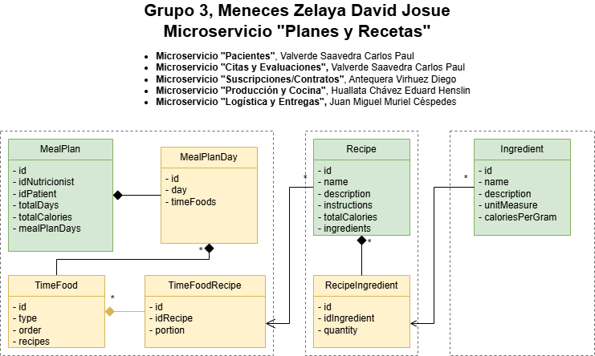

# Microservicio: Planes Alimentarios y Recetas

<p align="center">
  
</p>

## Description

El siguiente proyecto tiene por objetivo la gestion de los planes alimentarios, que podran ser asignados a los pacientes

## Main features

- **Registro de ingredientes:** listado y registro de ingredientes.  
- **Gestion de recetas:** permite crear, editar y eliminar una receta.
- **Gestion de planes:** permite registrar, editar y eliminar una plan alimentario.

# Running with Docker

## Image and Container
```shell script
docker image build --tag nurtricenter-nurtricenter-mealplans-api:1.0.0 .
docker container run -p 8080:8080 -d  --name nurtricenter-mealplans-api nurtricenter-mealplans-api:1.0.0
```

## Publish Tag DockerHub
```shell script
docker tag nurtricenter-mealplans-api:1.0.0 davidmeneces/nurtricenter-mealplans-api:1.0.0
docker push davidmeneces/nurtricenter-mealplans-api:1.0.0
```

## Running with Docker-Compose
```shell script
docker compose up -d
```